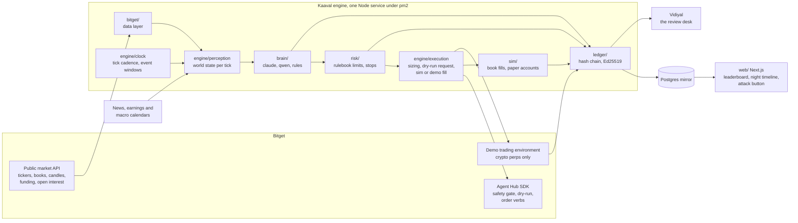
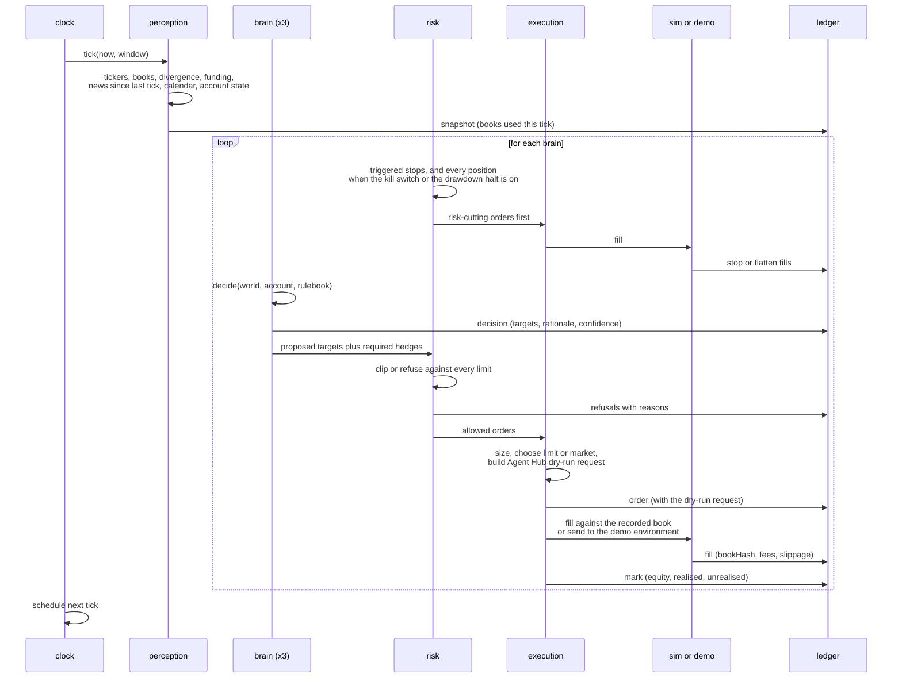
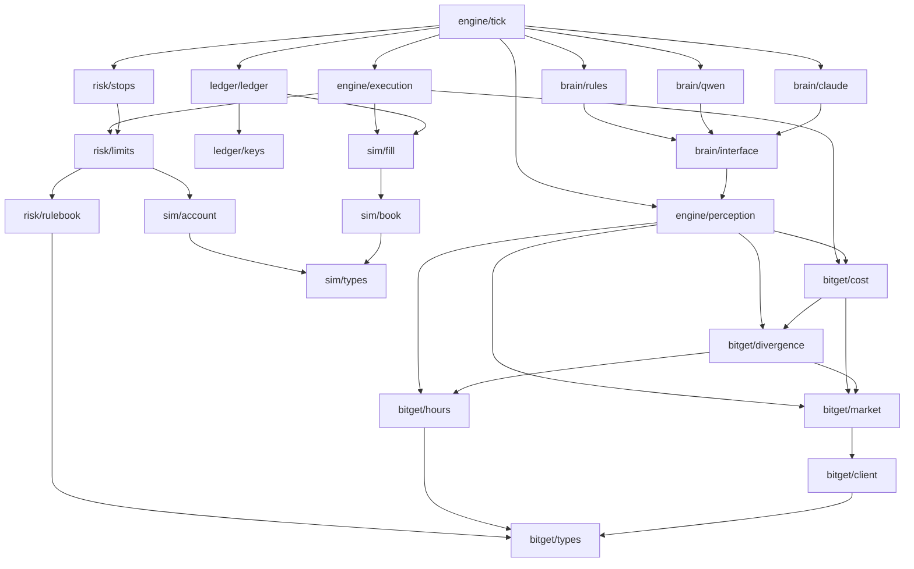
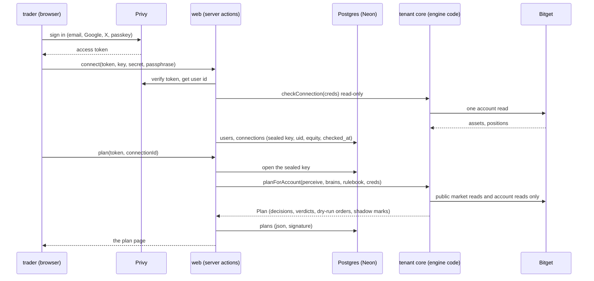

# Kaaval architecture

Kaaval is a night-shift trading harness for tokenized US stocks on Bitget. One rulebook, three
brains, three paper accounts, one signed record. This file is the map for anyone reading or
extending the code, and it is the handoff to the web app.

## What runs where

The engine never holds real money. Stock legs fill in our simulator against the live order book
that was recorded at that instant. Crypto hedge legs fill on Bitget's own demo environment,
which has BTC, ETH and XRP contracts and no stock symbols. Every order is first produced as an
Agent Hub dry-run request, so the record shows the exact order Bitget would have received.

## One tick, end to end

## Modules and what depends on what

Rules of the graph: `bitget/` and `sim/` know nothing about brains or risk. `brain/` produces
targets and reasons, never orders. `risk/` is pure functions over an account, a world state and
the rulebook; it has no network access and no model access, which is the whole point. Only
`engine/execution` creates orders, and only after `risk/` has spoken.

## The three brains

All three receive the identical world state, run under the identical rulebook, and trade the
identical sizes. The difference is only how the target is chosen.

| Brain | How it decides | Why it is here |
|---|---|---|
| claude | An ensemble of calibrated model calls over the world state, producing per-symbol targets with a written rationale | The primary LLM brain |
| qwen | The same prompt and schema through the sponsor's model, qwen3.8-max, over an OpenAI-style endpoint | Whether a different model reaches different decisions on the same facts |
| rules | A fixed, published rule set: basis mean-reversion between an rToken and its perp, weekend hedging, nothing else | The honest baseline; if the LLM brains cannot beat it, the record says so |

## The record

The ledger is append-only JSONL, one file per UTC day, every entry hashed over its content and
the previous hash, every hash signed with an Ed25519 key that lives outside the repo. Fills
reference the hash of the order book they were filled against, and that book is stored as a
snapshot entry, so `npm run replay` recomputes every fill and `npm run verify:ledger` proves
nothing was edited. Postgres is a mirror for the web app, never the source of truth.

## Kaaval for a trader's own account

A trader signs in, pastes a read-only Bitget key, and asks for tonight's plan: what every
brain would do for that account under the rulebook, as Agent Hub dry-run orders with shadow
fills, signed. No order is ever sent. The unattended per-account runner is the documented
next step, not built.

Rules of this layer:

- Read-only is enforced by our code, not by the key. `contextFor` builds the SDK with
  readOnly true and no path can turn it off; the SDK drops every write tool. There is no
  Bitget operation that reports a key's permissions, so we never claim to have checked them;
  we say what we do with the key.
- Keys are sealed with AES-256-GCM under a server key that lives only in the environment
  (`KAAVAL_KEY_SEAL_HEX`), opened for the seconds a plan runs, never logged, never returned to
  the browser.
- The user id is Privy's DID, verified on the server with the app secret for every action.
- A plan is stored as JSON with an Ed25519 signature under the same public key as the
  record, so a trader can verify a plan the way a judge verifies the ledger.
- Postgres tables: `users` (id, created_at), `connections` (id, user_id, label, uid, sealed,
  equity_usdt, positions, checked_at, status, created_at), `plans` (id, connection_id, ts,
  window, plan jsonb, signature, created_at), `audit` (user_id, kind, at, detail). The
  engine's public record stays in files and the record repository; the database holds only
  what belongs to a signed-in trader.
- Tests run against pglite, an embedded Postgres, with the same SQL; production runs on Neon
  through `pg` with a small pool, because both Vercel and a long-lived VM process are the
  cases Neon's own guide points at `pg` for.

## What the web app reads

The app is read-only. Every number on every screen comes from the signed ledger, the engine's
state file, or Bitget's public API at request time. Nothing is typed in. Until the Postgres
mirror exists, the app reads the files on the machine that runs the engine through one module,
`web/lib/record.ts`, and the same module gets a Postgres backend later without the screens
changing.

| Screen | Reads | Source |
|---|---|---|
| Ticker strip | Last price and 24h change for every symbol in the universe | Bitget public tickers through the SDK, fetched server-side per request, cached 30 seconds |
| Scoreboard | Per brain: equity now, equity curve, realised, unrealised, drawdown from peak, day P&L, open positions, fills count, refusals count, last decision summary and time, halted flag | `mark` entries per brain (the curve is every mark), `fill` and `reject` counts, the newest `decision`, `data/state/engine.json` for positions and halted |
| Night timeline | For a chosen UTC day: every tick in order, and per tick per brain the decision (summary, targets, rationale, model calls, latency, error), the refusals (rule, reason), the orders (intent, dry-run request, stop request), the fills (price, qty, fee, slippage, book hash), the mark | All entries of that day's ledger file, grouped by tick time and brain |
| Decision detail | One decision with its targets and rationale, the world it saw (symbols with divergence and spread), the verdict for each target, and the fill it led to | The `decision` entry, the nearest earlier `snapshot` entries, the `reject` and `fill` entries that follow it for that brain |
| Refusal log | Every refusal across brains, filterable by rule | `reject` entries |
| Halts | Every kill switch and drawdown halt with what was flattened | `halt` entries |
| Rulebook | The rulebook text in force, and every config change | `config` entries that carry `rulebook` text |
| Proof panel | The output of `verify:ledger`, `replay` and `attack` as last run, with the public key and entry count | `data/state/proof/latest.json`, written by `npm run proof:web` (a script the frontend order adds) that runs the three commands and stores their output with a timestamp |
| Trade log | The six-field CSV for download | `data/state/trades.csv` |

Writes: none. The "try to break it" button re-runs the attack script on the server that hosts
the engine and shows the fresh table; on a host without the engine it shows the last stored
run and says so.

Labels: the word simulated appears on the scoreboard, the timeline, the trade log and the
proof panel. The record's start time and any gap longer than one cadence are shown, never
smoothed over.
