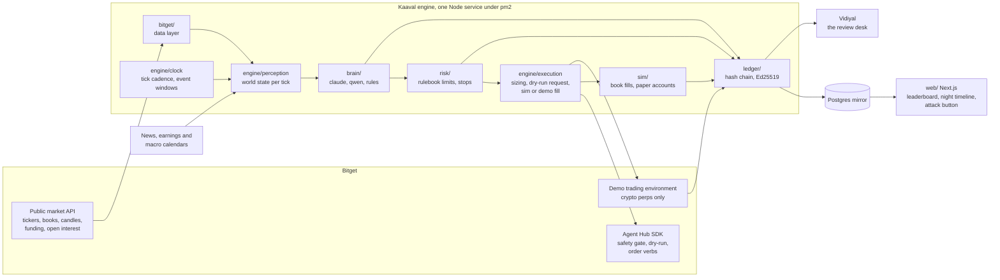
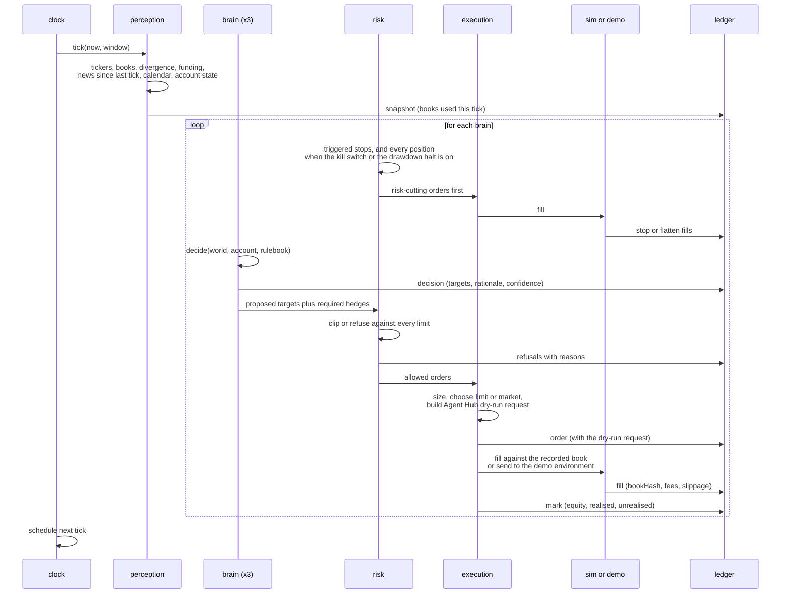
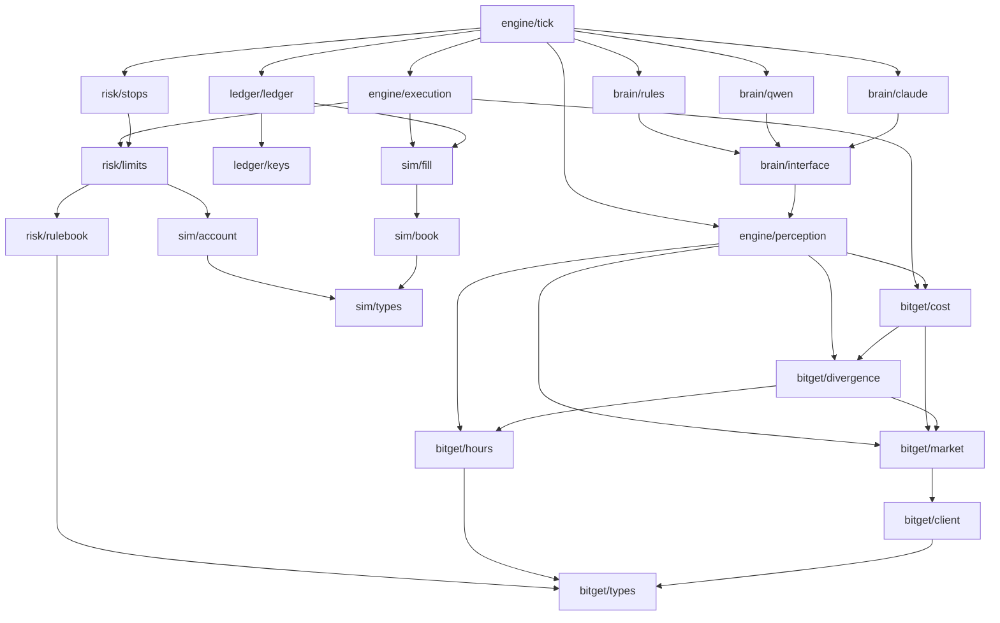

# Kaaval

Kaaval is Tamil for guard, the watchman on the night shift.

Kaaval is a night-shift trading desk for tokenized US stocks on Bitget: three brains trade paper
accounts under one rulebook while New York is shut, and every decision, refusal and fill is
signed into a record a stranger can replay.

Live site: pending deploy <!-- Ram: paste the Vercel URL here when the deploy is done -->
&nbsp;|&nbsp; Documentation: `/docs` on the live site
&nbsp;|&nbsp; [Bitget AI hackathon](https://bitget-ai.gitbook.io/bitgetai_hackathons2)
&nbsp;|&nbsp; [Bitget Agent Hub](https://github.com/Bitget-AI/agent_hub)

## The record

Kaaval holds no real money. Every fill below is simulated against a Bitget order book that was
read at that instant and stored beside the fill. The record says so on every screen, and the
numbers are ones a judge can recompute.

| | |
|---|---|
| What it is | A simulated paper record. No real funds, no live orders. Crypto hedge legs can run on Bitget's demo environment when a demo key is present; stock legs cannot, because the demo environment has no stock symbols |
| Started | 2026-09-11T08:21:28Z, the first entry in the ledger |
| Entries | 135 signed entries as of 2026-09-12T07:54Z, and another group every tick |
| Fills | 5 simulated fills, all 5 reproduce from the recorded books |
| Decisions and refusals | 42 decisions, 24 refusals, 2 kill switch entries |
| Signing key | `41804536815325110d0feda7c57c9728730464b29a6b8637a458a71b95713a19`, Ed25519, private half kept outside the repo |
| Ledger | `data/state/ledger`, append-only JSONL, one file per UTC day |
| Brains running | `claude` and `rules`. `qwen` is wired and skipped while `QWEN_API_KEY` is unset, and the engine log says so every tick rather than pretending it ran |
| Cadence | One tick every 15 minutes, one every 2 minutes for an hour after a scheduled event and for 30 minutes either side of the New York open |
| Gaps | Two, both visible in the timestamps. 21 minutes on 11 September, 09:45Z to 10:06Z. Then 18 hours 33 minutes, 11 September 11:23Z to 12 September 05:56Z, while the machine that runs the engine was off. The hash chain carries across a gap; the clock does not, and the site shows it as a gap instead of smoothing the line |

The kill switch is in the record too. It was pulled live on 11 September at 08:42:20Z and
released at 08:59:09Z, and two orders were refused under the rule `safety.kill` in between.

### The public record

The record does not only live on the machine that runs the engine. Every 15 minutes a
publisher copies it into its own public git repository, so the site reads it over plain
HTTPS and anyone can clone it and check the signatures without asking us for anything.

```bash
npx tsx scripts/publish-record.ts --once    # one publish, then exit
pm2 start ecosystem.config.cjs --only kaaval-publisher   # every 15 minutes
```

Published repository: pending <!-- Ram: paste the record repo URL here when it exists -->

What goes in, and nothing else: the ledger day files, the engine state file, the last proof
run, the trade log, the public half of the signing key, Vidiyal's review bundles, and a
manifest for each side saying how many entries and reviews are in there. The publisher
refuses to run at all if a file named like a private key, an environment file or a secret is
sitting in a directory it copies from, so the private key cannot reach the public repository
by accident.

The site reads whichever copy it is pointed at. With `KAAVAL_RECORD_URL` set to the raw base
of the published repository, every screen is built from those static files over HTTPS, which
is how the hosted site runs with no engine beside it. With it empty, the same screens read
the files on this machine. The numbers are identical either way, because both paths parse
with the same code.

Checking the published copy is the same command as checking the local one:

```bash
npm run verify:ledger -- ../record/kaaval/ledger ../record/kaaval/ledger-key.pub.hex
# chain:      ok, 140 entries verified
# replay:     5 of 5 fills reproduce from the recorded books
```

## What this is, and why

Bitget lists tokenized US stocks that trade 7 by 24. The stock market they track is open about
32 hours a week. So for most of every week there is a price for rNVDA and rSPY with no exchange
behind it, and Bitget's own pages say the weekend quote is a reference price that re-anchors when
New York opens. That is a real gap where a human cannot sit, and where a model left alone with a
wallet is a bad idea.

Kaaval sits in that gap. One rulebook in plain English, three brains that see the identical world
state and trade the identical sizes, a risk layer that is pure code with no network and no model
access, and a signed ledger that makes the whole night checkable after the fact. The brains
propose. The rulebook disposes. The record shows which of them was right.

| | A typical AI trading bot | Kaaval |
|---|---|---|
| Brains | One model, one opinion, no control | Three under one rulebook: Claude, Qwen, and a published rules baseline that carries no model at all |
| Evidence | A screenshot of a P&L curve | A signed hash chain. `npm run verify:ledger` names the first entry that was edited |
| Can you re-run it | No | Yes. `npx tsx scripts/replay.ts` recomputes every fill from the order book stored beside it |
| Where the stop lives | In the prompt, inside the model's reach | In `risk/`: pure functions, no network, no model, run before any brain is asked anything |
| Prompt injection | The headline is an instruction | Headlines are fenced as `data:`, the reply is JSON against a schema, and `npm run attack` runs 16 hostile scenarios against the risk layer on every change |
| How a judge checks it | Takes your word | Runs three commands in two minutes and reads the output |

## Features

### For the trader who is asleep

- **One rulebook, written down.** Exposure caps, loss limits, entry gates and the cross-asset
  hedge rule live in [`docs/rulebook.md`](docs/rulebook.md) and as data in `src/risk/rulebook.ts`.
  The exact text is handed to both language-model brains and written into the ledger, so the
  record shows which rules were in force for every trade.
- **The cross-asset hedge rule.** Any rToken position over 5 percent of equity must carry a hedge
  of at least half its delta, in its own stock perpetual or in SPY, whenever divergence is over
  0.5 percent or New York will be shut for more than 24 hours. Every weekend counts.
- **A kill switch that is one file.** `touch data/state/KILL` halts new risk within one tick and
  writes a halt entry. Reduce-only orders and stops still pass, because a switch that stops a
  position from closing is not a safety feature.
- **Flat means flat.** Past the 12 percent drawdown halt, and for every brain while the kill
  switch is on, each open position is closed with a reduce-only order in the same tick, and the
  halt entry lists what was flattened.
- **Risk runs first.** Stops and halts execute before any brain is asked anything, so a stop
  never waits on a model that is thinking.

### Kaaval for your account

- **Paste a read-only key and see tonight's plan.** Kaaval reads your real Bitget balances
  and positions, builds the same account view the three brains already read, and shows every
  order it would have sent for your account: the Agent Hub request Bitget would have
  received, the rulebook's verdict on each one with the rule that refused it, and a fill
  priced against tonight's order book. Nothing is ever sent. The key goes through a surface
  the SDK builds read-only, every order is a dry run answered before the network, and a test
  asserts on the calls actually made rather than on that promise. The key itself is sealed
  with AES-256-GCM before it is stored, and every plan is signed into a ledger of its own,
  one per account. Run `npx tsx scripts/plan-for-account.ts`: with the three
  `BITGET_TENANT_*` values set it plans against your account, and with none of them set it
  plans against a fixture account so you can see the shape first.

### For your account

- **Sign in, connect a read-only key, get tonight's plan.** Sign-in is Privy: email, Google,
  X or a passkey, verified on our server for every action. Paste a Bitget key at `/connect`
  and Kaaval checks it with one read, shows the account it saw, and stores it sealed with
  AES-256-GCM under a key that lives only in the environment. At `/account` you get a plan
  on demand: about a minute of market reads and model calls, then every target, every
  rulebook verdict, every dry-run order with the exact Agent Hub request, and a shadow fill
  against tonight's book. Each plan is signed with an Ed25519 key and stored, so you can
  check later that it was not edited. Asking twice inside five minutes gives back the same
  plan, and six plans an hour is the limit, counted against your sign-in. No screen in the
  product can place an order.

### For the judge

- **The ledger.** Append-only JSONL, every entry hashed over its content and the previous hash,
  every hash signed with an Ed25519 key kept outside the repo.
- **`npm run verify:ledger`.** Checks the chain and every signature, and names the first entry
  that breaks.
- **`npx tsx scripts/replay.ts`.** Re-runs every recorded fill against the order book snapshot it
  names, with the fee and slippage model that was recorded before it.
- **`npm run attack`.** Sixteen hostile scenarios against the risk layer with no network, no model
  and no keys: ten refused, two cut down, four controls allowed through.
- **The proof panel** at `/proof`, with a button that re-runs the three checks on the machine that
  holds the ledger and shows the fresh output.
- **The six-field trade log** at `data/state/trades.csv`, rebuildable from the signed ledger with
  `npx tsx scripts/export-log.ts`.

### For the developer

- **Agent Hub dry-run requests.** Every order is first rendered by the SDK's own safety layer as
  the request Bitget would have received, and that request sits in the ledger next to the fill.
- **A paper harness you can point anywhere.** The simulator fills against a real recorded book, the
  paper account is pure, and a 2,000-case fuzz test holds equity equals starting balance plus
  realised plus unrealised.
- **One brain interface, three implementations.** `decide(world, account, rulebook)` returns targets
  and a written rationale, never orders.
- **Two models behind one prompt.** Claude and Qwen get the identical world state, the identical
  rulebook text and the identical JSON schema, so a difference in the record is a difference in the
  model.

## How Kaaval uses Bitget

Every read goes through the Bitget Agent Hub SDK (`@bitget-ai/bitget-agent-sdk` 3.3.0), not raw
HTTP. The market context is built read-only, so no code path in Kaaval can place an order by
accident.

| Agent Hub call | What Kaaval does with it | Where in the code |
|---|---|---|
| `market` action `tickers` | Last price, touch and 24 hour volume for every symbol in the night's universe, plus the whole-category sweep that builds that universe | `src/bitget/market.ts` `getTicker`, `src/engine/universe.ts` |
| `market` action `orderbook` | The book every simulated fill is priced against. Its hash goes into the fill and the book itself is stored as a ledger snapshot | `src/bitget/market.ts` `getOrderBook` |
| `market` action `candlesHistory` | The 15 minute candle at the last regular New York close, which is the anchor divergence is measured from | `src/bitget/divergence.ts` |
| `market` action `instruments` | Builds the universe from Bitget's own listing data: which tokens are stocks, fee rates, price and quantity precision, minimum order size | `src/bitget/market.ts` `listStockInstruments` |
| `market` action `fundingRate` | The carry on every perpetual hedge leg, read once per tick | `src/bitget/market.ts` `getFunding` |
| `market` action `fundingRateHistory` | What a hedge cost over the weekend it was held | `src/bitget/market.ts` `getFundingHistory`, `src/bitget/cost.ts` |
| `market` action `openInterest` | Crowding on the hedge legs | `src/bitget/market.ts` `getOpenInterest` |
| `order` action `place` with `dryRun: true` | Every order, before anything fills anywhere. The SDK answers a dry run from its safety layer before it looks at a credential, so this is Bitget's own rendering of the request, recorded in the ledger | `src/engine/execution.ts` `agentHubRequest` |
| `order` on the demo trading environment (`paperTrading: true`) | Crypto hedge legs on Bitget's demo contracts SBTCSUSDT, SETHSUSDT and SXRPSUSDT when a demo key is present | `src/engine/execution.ts` `placeOnDemo`, `scripts/run-engine.ts` |
| `placeStrategyOrder` shape (`type: tpsl`) | Every stop written as the Agent Hub call that would arm it on Bitget's servers, recorded in the order entry that creates the position | `src/risk/stops.ts` `stopDryRunRequest` |
| SDK safety flags `readOnly` and `paperTrading` | The market context is read-only and the order desk is dry-run only, enforced at the SDK layer rather than by our own discipline | `src/bitget/client.ts` `createBitget` |

## Architecture

### What runs where



### One tick, end to end



### Modules and what depends on what



`bitget/` and `sim/` know nothing about brains or risk. `brain/` produces targets and reasons,
never orders. `risk/` is pure functions over an account, a world state and the rulebook, with no
network access and no model access, which is the whole point. Only `engine/execution` creates
orders, and only after `risk/` has spoken.

## The two-minute judge path

The first two commands need nothing but `npm install`: no API key, no network, no record. The
three record checks read `data/state`, which is the live record on the machine that runs the
engine and is deliberately not in git. The same output is published at `/proof` on the site and
stored in `data/state/proof/latest.json`.

```bash
npm install
```

**1. The test suite.** No network, no keys.

```bash
npm test
```

```
 Test Files  38 passed | 2 skipped (40)
      Tests  323 passed | 6 skipped (329)
```

**2. Try to break the risk layer.** No network, no model, no keys. The brain obeys the poisoned
headline; the rulebook does not.

```bash
npm run attack
```

```
16 scenarios: 10 refused, 2 cut down, 4 allowed.
Every attack landed where the rulebook says it should, and every control still passed.
```

**3. Check that nobody edited the record.**

```bash
npm run verify:ledger -- data/state/ledger
```

```
ledger:     data/state/ledger
public key: 41804536815325110d0feda7c57c9728730464b29a6b8637a458a71b95713a19
chain:      ok, 135 entries verified
replay:     5 of 5 fills reproduce from the recorded books
```

**4. Re-run every trade against the book it hit.**

```bash
npx tsx scripts/replay.ts
```

```
chain:      ok, 135 entries verified
replay:     5 of 5 fills reproduce from the recorded books
replay:     ok
```

**5. See where the paper accounts stand right now.**

```bash
npx tsx scripts/status.ts
```

```
KAAVAL STATUS. Every fill below is simulated against a recorded Bitget order book.
state:      D:\Projects\Bitget\kaaval\data\state\engine.json
ledger:     D:\Projects\Bitget\kaaval\data\state\ledger
last tick:  2026-09-12T07:43:39.807Z, 8 minutes ago
kill switch: off

claude
  equity      9,996.05 usdt, realised -1.27, unrealised -2.68
```

**Then open the site, in this order:**

1. `/` and scroll to `#record`. The scoreboard: equity, realised before unrealised, drawdown, open
   positions, refusals and the last decision for each brain, all read from the ledger.
2. `/timeline?day=2026-09-11`. One night as time, a lane per brain. The kill switch at 08:42Z, the
   two orders refused under it, and the release at 08:59Z are all on the line.
3. Click any decision to open `/decisions/<seq>`: the targets the brain proposed, the world it saw,
   the verdict each target got from the rulebook, the Agent Hub dry-run request, and the fill.
4. `/proof`, then press **try to break it**. On the machine that holds the ledger the button re-runs
   the three checks and shows the fresh output. Anywhere else it shows the stored run and says on
   the page that this host does not run the engine.
5. `/docs` for the long form: how a night runs, the Bitget verbs, the ledger format, the threat
   model and the self-audit.

## Quick start

```bash
npm install
cp .env.example .env      # then fill in the keys below
```

### What goes in `.env`

Public market reads need none of these. Every price, book, candle and instrument call in
`src/bitget` works with the file empty.

| Variable | What it is for | Needed |
|---|---|---|
| `ANTHROPIC_API_KEY` | The Claude brain. Without it that brain is skipped and the log says so | For the Claude brain |
| `KAAVAL_USER_AGENT` | The contact string SEC demands on every EDGAR request, as `Kaaval research you@example.com` | For SEC filings |
| `QWEN_API_KEY`, `QWEN_BASE_URL`, `QWEN_MODEL` | Bitget's hackathon Qwen proxy. Defaults are `https://hackathon.bitgetops.com/v1` and `qwen3.8-max` | Optional. The Qwen brain is skipped without the key, never failed |
| `KAAVAL_CLAUDE_MODEL` | Which Claude model the brain calls. Defaults to `claude-haiku-4-5-20251001` | Optional |
| `FINNHUB_API_KEY` | Company news and the earnings calendar. EDGAR and GDELT need no key | Optional |
| `BITGET_API_KEY`, `BITGET_SECRET_KEY`, `BITGET_PASSPHRASE` | Only used to render Agent Hub dry runs through the SDK's trade module. Market reads never touch them | Optional |
| `BITGET_DEMO_API_KEY`, `BITGET_DEMO_SECRET_KEY`, `BITGET_DEMO_PASSPHRASE` | Bitget's demo environment for the crypto hedge legs. Without all three, those legs stay simulated | Optional |
| `KAAVAL_LEDGER_DIR`, `KAAVAL_STATE_FILE`, `KAAVAL_LEDGER_KEY`, `KAAVAL_KILL_FILE` | Where the record, the engine memory, the signing key and the kill file live | Optional, all default under `data/` |
| `KAAVAL_PAPER_BALANCE`, `KAAVAL_MAX_SYMBOLS`, `KAAVAL_ENSEMBLE_RUNS`, `KAAVAL_DECISION_TIMEOUT_MS` | Starting balance, universe size, model runs per brain per tick, and how long a brain may think | Optional |
| `KAAVAL_HTTP_TIMEOUT_MS`, `KAAVAL_BITGET_TIMEOUT_MS`, `KAAVAL_TICK_TIMEOUT_MS` | Deadlines on a news request, a Bitget request and a whole tick | Optional |
| `KAAVAL_HALT` | Set to `1` to halt new risk without touching the kill file | Optional |
| `KAAVAL_DATA_DIR` (site) | Which record the site reads. Defaults to `../data/state` | Optional |
| `KAAVAL_PROOF_RUNNER` (site) | Set to `local` only on the machine that holds the ledger, so the proof button can re-run the checks | Optional |
| `NEXT_PUBLIC_PRIVY_APP_ID`, `PRIVY_APP_SECRET` (site) | Sign-in for the account area. Without them `/connect` says sign-in is not configured on this host | For the account area |
| `DATABASE_URL` (site) | Postgres for signed-in traders: their keys and their plans. Use the pooled connection string | For the account area |
| `KAAVAL_KEY_SEAL_HEX` (site) | The server key a trader's Bitget key is sealed with. Without it a key cannot be stored | For the account area |
| `KAAVAL_PLAN_KEY_PEM` (site) | The Ed25519 key each stored plan is signed with. Without it a plan says plainly that it is unsigned | Optional |
| `KAAVAL_WEB_ENSEMBLE_RUNS` (site) | Model runs per brain when a plan is made from the site. Defaults to 1 | Optional |

`.env.example` carries the same list with a one-line comment on each.

### One tick, nothing written

```bash
npx tsx scripts/run-engine.ts --dry-run --once   # perceive and decide, execute nothing, write nothing
npx tsx scripts/run-engine.ts --once             # one tick, written to the ledger
```

### The engine, unattended

```bash
pm2 start ecosystem.config.cjs   # one tick every 15 minutes
pm2 save                         # survive a reboot
pm2 logs kaaval --lines 20       # what it just did
```

### The site

```bash
cd web
npm install
npm run dev                                  # http://localhost:3000
NEXT_DIST_DIR=.next-verify npm run build     # a build that leaves the dev server's .next alone
npx tsx scripts/migrate.mts                  # brings the trader database up to date, or
                                             # proves the migrations apply with no database set
```

The home page is the night told as a story: four o'clock in the morning, what the watch sees,
what the rulebook allows, and the record underneath it. It scrolls from the first beat down to
the scoreboard at `#record` and the proof panel at `#proof`.

| Page | What is on it |
| --- | --- |
| `/` | The story of one night, then the scoreboard at `#record` and the proof panel at `#proof` |
| `/timeline` | One night as time, a lane per brain, the kill switch on the line |
| `/decisions/<seq>` | One decision: the world the brain saw, its targets, the verdict on each, the fill |
| `/refusals` | Every order the rulebook refused, with the rule that refused it |
| `/rulebook` | The limits themselves, as the engine reads them |
| `/proof` | The three checks, re-run on the machine that holds the ledger |
| `/connect` | Sign in and connect a read-only Bitget key |
| `/account` | The keys you have connected, and every plan Kaaval has made for them |
| `/account/plans/<id>` | One plan: every target, every verdict, every dry-run order |
| `/docs` | The long form, built from the markdown in `web/content/docs` |

The documentation lives inside the site at `/docs`, built from the markdown in
`web/content/docs`. There is no separate documentation site to run or deploy.

Unattended, next to the engine:

```bash
cd web
KAAVAL_PROOF_RUNNER=local pm2 start node --name kaaval-web -- node_modules/next/dist/bin/next dev
pm2 save
```

The site is read only. Every number on it comes from the signed ledger, the engine state file or
Bitget's public tickers read on the server. Nothing is typed in.

### The trade log

```bash
npx tsx scripts/export-log.ts     # rebuild data/state/trades.csv from the signed ledger
```

Six fields plus the brain and a note carrying the fee, the slippage and the book hash. Because it
is rebuilt from the record, the CSV is reproducible rather than a file you have to trust.

### The kill switch

```bash
touch data/state/KILL    # halt new risk within one tick
rm data/state/KILL       # trade again from the next tick
```

## The rulebook

Defaults from `src/risk/rulebook.ts`. Every change is a config entry in the ledger, so the record
shows which numbers were in force for each trade. Full text and the reasoning behind each number:
[`docs/rulebook.md`](docs/rulebook.md).

| Limit | Default | What happens |
|---|---|---|
| Per symbol | 10 percent of equity | Order cut down to the cap |
| Gross exposure | 60 percent of equity | Cut down |
| Net exposure | 40 percent of equity | Cut down |
| Open positions | 8 | Refused |
| Order size | 100 to 500 USDT | Below is refused, above is cut down |
| Daily loss | 2 percent of start-of-day equity | Reduce-only for the rest of the UTC day |
| Drawdown from peak | 8 percent | Every size halved |
| Drawdown from peak | 12 percent | Flat everything and halt until a human restarts |
| Stop on every position | 3 percent on rTokens, 2 percent on perpetuals | Placed with the entry |
| Spread | At most 30 basis points | Refused |
| Divergence for a new unhedged long | At most 1 percent from the last regular close | Refused |
| Share of the visible book | At most 25 percent | Refused |
| No entries | 09:25 to 09:40 ET, when Bitget's guidance says prices re-anchor | Refused |
| Pre-open | No new unhedged rToken long in the last 30 minutes when divergence is over 0.5 percent | Refused |
| Cross-asset hedge | Any rToken over 5 percent of equity carries a hedge of at least half its delta when divergence is over 0.5 percent or New York is shut for more than 24 hours | Hedge required |
| Universe | 200,000 USDT minimum 24 hour volume, traded through the last weekend, has a matching perpetual | Anything else is refused, not resized |
| Cadence | 15 minutes normally, 2 minutes for 60 minutes after an event and 30 minutes either side of the open | |

## Tests

```
$ npm test

 RUN  v5.0.0 D:/Projects/Bitget/kaaval

 Test Files  38 passed | 2 skipped (40)
      Tests  323 passed | 6 skipped (329)
   Start at  14:42:14
   Duration  3.24s (tests 54%, transform 29%, import 15%, worker 1%)
```

The two skipped files are the live Bitget reads. They run with `LIVE=1 npm test`.

## What a night costs

All of this is observed, from `data/state/logs/kaaval-out.log` and the decision entries in the
ledger for 11 and 12 September 2026.

- **Bitget reads: 36 per tick in the steady state.** The universe was 14 symbols, which the log
  prints on every tick line: 6 rTokens, their 6 stock perpetuals, plus BTC and ETH. Each symbol
  costs one ticker and one order book, with a funding read on the 8 perpetuals. The divergence
  anchor costs 6 more candle reads once per New York close, not per tick, because it is cached
  against the close it is measured from. All of them are public reads with no key.
- **Model calls: 3 per language-model brain per tick.** Every one of the 21 Claude decisions in the
  record carries `modelCalls: 3`, with a median prompt of 9,594 tokens and a median completion of
  6,183. That drops to 2 runs in the event and open windows.
- **Wall clock: 51 to 124 seconds per tick** across the last eight ticks in the log. The median
  Claude decision took 67.7 seconds and the slowest 99.1. The longest ticks are the ones where
  GDELT answered 429 and the news gather retried once before giving up on that query.
- **The bill.** Market data is free and public, so the only cost of running Kaaval is the model
  calls.

## Project structure

```
src/
  bitget/      Agent Hub SDK client, market reads, trading hours, divergence, cost model
  brain/       the three brains, the shared prompt, the JSON schema, the ensemble
  risk/        the rulebook as data, the limit checks, the stop tracker. Pure, no network
  sim/         order book fills, the paper account, recorded books
  ledger/      the Ed25519 hash chain, verify and replay
  news/        SEC EDGAR, GDELT, Finnhub, the calendar, and the pacing that keeps them polite
  engine/      perception, clock, execution, tick, state, universe, trade log
  proof/       the live data prove-it run
scripts/       run-engine, status, verify-ledger, replay, attack, export-log, proof-web, discover
web/           the Next.js site: scoreboard, night timeline, decisions, refusals, rulebook, proof,
               and the documentation at /docs, written in web/content/docs
docs/          the rulebook, the threat model, the judge path, the SDK schema dump
data/state/    the live record: ledger, engine state, trade log, proof run, logs. Not in git
test/          38 files: unit, fuzz, invariant, injection and live-read tests
```

## Tech stack

Versions read from `package.json` and `web/package.json`. Everything load-bearing is pinned
exactly; a caret means the lockfile pins the resolved version.

| Part | Choice | Version |
|---|---|---|
| Bitget access | `@bitget-ai/bitget-agent-sdk` | 3.3.0 |
| Runtime | Node | 26.7.0 on the engine machine |
| Language | TypeScript | 7.0.2 |
| Runner | tsx | 4.23.13 |
| Tests | vitest | 5.0.0 |
| Claude brain | `@anthropic-ai/sdk` | 0.124.0 |
| Qwen brain | Bitget's hackathon proxy, OpenAI-style, `qwen3.8-max` | no SDK dependency |
| Environment | dotenv | 17.4.2 |
| Process manager | pm2 | installed globally on the engine machine |
| Site framework | Next.js | 16.3.5 |
| Site runtime | react, react-dom | 19.2.8 |
| Motion | framer-motion, gsap, lenis | 13.2.0, 3.15.0, 1.3.26 |
| Styling | tailwindcss, `@tailwindcss/postcss` | ^4 |
| Lint | eslint, eslint-config-next | ^9, 16.3.5 |

## Security

The full write-up, including what is not fixed, is in
[`docs/security/threat-model.md`](docs/security/threat-model.md).

1. **There is no money to steal.** Kaaval holds no funds and places no live orders. The market
   context is built read-only at the SDK layer and the order desk only ever sends `dryRun: true`.
2. **Headlines are evidence, never instructions.** Every headline is fenced as `data:`, the reply
   must validate as JSON against a schema that only admits symbols present in the world state, and
   `npm run attack` proves sixteen hostile scenarios land where the rulebook says they should.
3. **The risk layer cannot be talked to.** `risk/` is pure functions with no network and no model
   access. It runs before the brains and again after them, and every refusal names its rule in the
   ledger.
4. **The record cannot be tidied.** A hash chain plus Ed25519 signatures, with the private key kept
   outside the repo, and `verify:ledger` names the first entry that breaks.
5. **Not fixed, and said out loud.** A resting limit order is assumed filled at its own price, which
   flatters a thin book. The fill simulator is ours, because Bitget's demo environment has no stock
   symbols. Divergence is measured against Bitget's own last regular close, not the NYSE print. The
   model is still a black box: the schema and the rulebook bound what a decision can do, they do not
   explain it. And the engine runs on one machine, so a reboot shows as a gap in the timestamps
   rather than a smooth line.

## Licence

MIT. See [LICENSE](LICENSE).

## Acknowledgments

Built on the [Bitget Agent Hub](https://github.com/Bitget-AI/agent_hub) SDK and Bitget's public
market data, which is where every price, book, candle, funding rate and instrument in this project
comes from. The Qwen brain runs on Alibaba's qwen3.8-max through the proxy the Bitget hackathon
provides. News and filings come from SEC EDGAR, GDELT and Finnhub.
