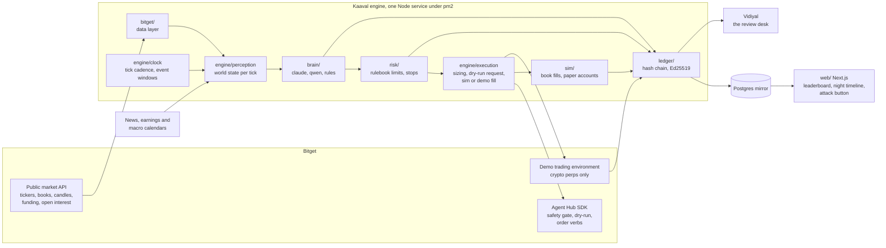
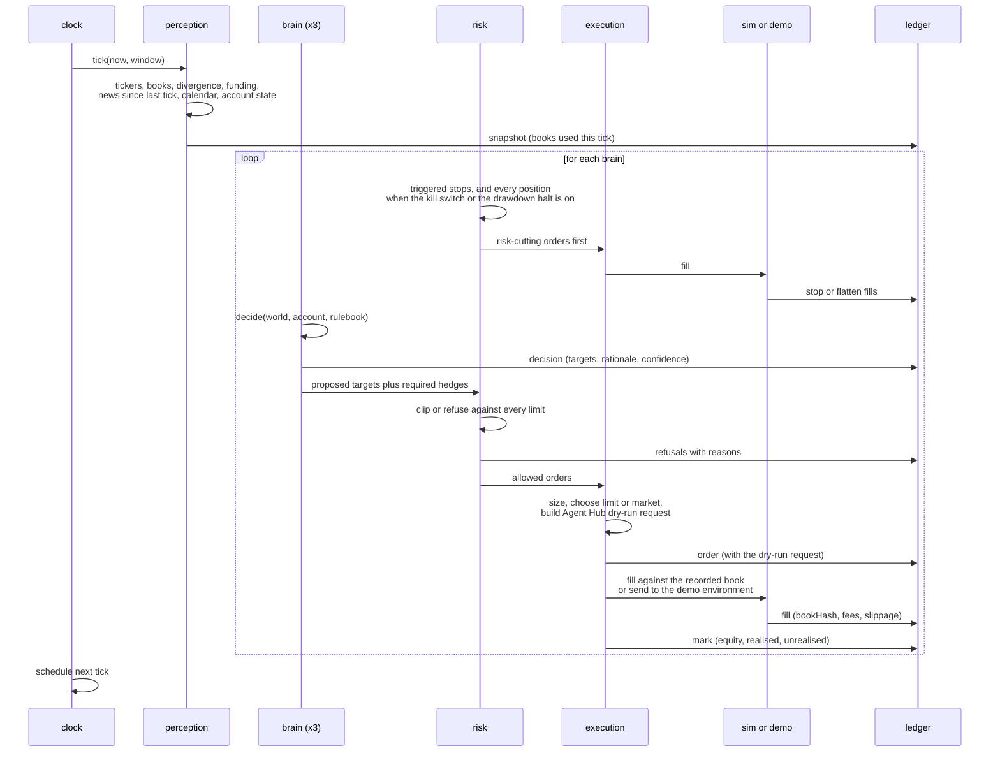
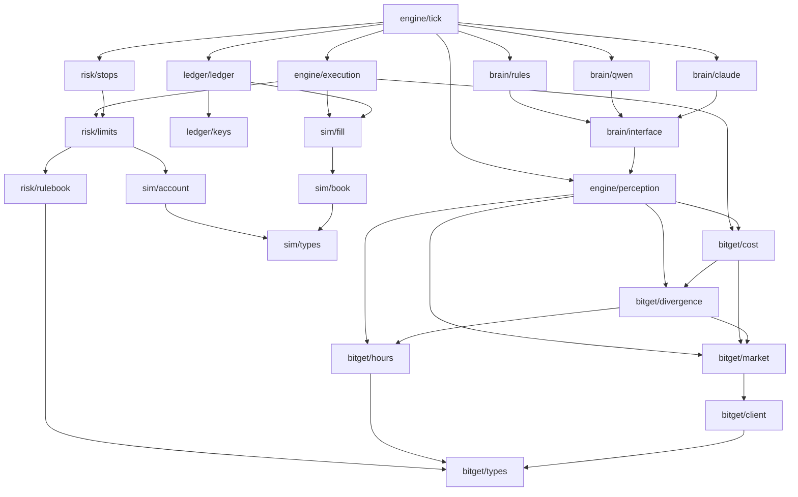

Three diagrams: what runs where, one tick end to end, and which module depends on which. They are
the same three that are in the repository's `ARCHITECTURE.md` and its README, so a reader who
starts in either place is looking at the same map.

## What runs where

The engine never holds real money. Stock legs fill in our simulator against the live order book
that was recorded at that instant. Crypto hedge legs fill on Bitget's own demo environment, which
has BTC, ETH and XRP contracts and no stock symbols. Every order is first produced as an Agent Hub
dry-run request, so the record shows the exact order Bitget would have received.

Two boxes in that diagram are not built yet and are drawn because they are where this is going. The
Postgres mirror does not exist: today the site reads the record as files, through one module,
`web/lib/record.ts`, which gets a Postgres backend later without the screens changing. Vidiyal is
the companion project, a review desk that grades Kaaval's decisions after the fact from the same
ledger.

## One tick, end to end

Read that top to bottom and you have the ordering guarantee that matters: risk-cutting orders
execute before any brain is asked anything. A stop and a model that is thinking never wait for each
other. The [engine loop](/docs/developers/engine-loop) page walks the same sequence in words, with the
deadlines and the restart behaviour.

## Modules and what depends on what

Rules of the graph, and they are enforced by review rather than by a linter:

- `bitget/` and `sim/` know nothing about brains or risk.
- `brain/` produces targets and reasons, never orders.
- `risk/` is pure functions over an account, a world state and the rulebook. It has no network
  access and no model access, which is the whole point.
- Only `engine/execution` creates orders, and only after `risk/` has spoken.
